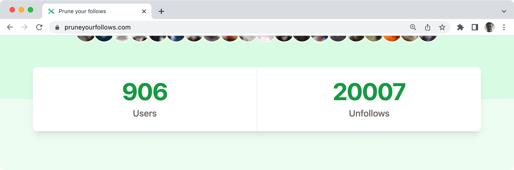
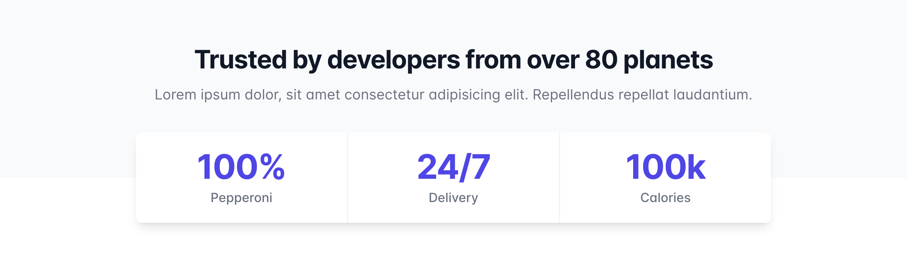

# Source Usage Data for Social Proof on Your Gatsby Site

On [pruneyourfollows.com](https://pruneyourfollows.com/), a tool to help you prune follows on Twitter, we've included this little "social proof" section:



## What is Social Proof?

Social proof increases visitors' trust in your product. By showcasing that loads of people already use Prune your Follows with the "number of users" stat, we show potential users that "you are not the first!" The "number of unfollows" stat implicitly conveys the message, "You'll be okay. It works."

## How to Source Usage Data

For Prune your Follows, the steps involved are:

1. Get the number of users from Xata
2. Get the number of unfollows from Xata
3. Create one Gatsby `UsageData` Node with the numbers

More generically:

1. Get the number of users from your database
2. Get another key number from your database
3. Create one Gatsby Node for the numbers

👀 Look for the corresponding step numbers in the code: 1️⃣, 2️⃣ and 3️⃣.

```js
exports.sourceNodes = async (gatsbyUtils) => {
  const { reporter, actions, createNodeId, createContentDigest } = gatsbyUtils;
  const { createNode } = actions;

  const result = await xata.db.accounts.aggregate({
    // 1️⃣ Get the number of users from Xata
    unfollowsTotal: {
      count: {
        filter: {
          // Unfollowed is greater than PYF launch data
          unfollowed: { $ge: new Date("2022-11-03") },
        },
      },
    },
    // 2️⃣ Get the number of unfollows from Xata
    usersTotal: {
      uniqueCount: {
        //number of account rows where followed_by is unique
        column: "followed_by",
      },
    },
  });

  const usageData = {
    unfollowedCount: result.aggs.unfollowsTotal,
    userCount: result.aggs.usersTotal,
  };

  // 3️⃣ Create one Gatsby `UsageData` Node with the numbers
  createNode({
    id: createNodeId("UsageData"),
    ...statsData,
    internal: {
      type: "UsageData",
      contentDigest: createContentDigest(usageData),
    },
  });
};
```

## How to Display Usage Data

I have seen some very creative usage data designs, but you can also get away with a simple design like ours. We lifted it from the [Tailwind UI Components Stats Section](https://tailwindui.com/components/marketing/sections/stats-sections).



The steps involved:

1. Query the usage numbers from the Gatsby Data Layer
2. Display the data with the design of your choosing

👀 Again, look for the step numbers in the code example: 1️⃣ and 2️⃣.

```jsx
import React from "react";
import { useStaticQuery, graphql } from "gatsby";

export function UsageData() {
  // 1️⃣ Query the usage numbers from the Gatsby Data Layer
  const data = useStaticQuery(graphql`
    query {
      usageData {
        unfollowedCount
        userCount
      }
    }
  `);

  // 2️⃣ Display the data with the design of your choosing
  return (
    <section>
      <dl>
        <dt>Users</dt>
        <dd>{data.usageData.userCount}</dd>

        <dt>Unfollows</dt>
        <dd>{data.usageData.unfollowedCount}</dd>
      </dl>
    </section>
  );
}
```

## Where To Go From Here?

I hope you feel inspired to create a social proof section for your site, and you might find these resources helpful while doing so:

- The [Tailwind Components Stats Section](https://tailwindui.com/components/marketing/sections/stats-sections) for design inspiration.
- The [Xata Getting Started Guide](https://xata.io/docs/overview) to give Xata a spin.

Feel free to tweet me ([@raae](https://twitter.com/raae)) a link when you deploy your social proof section, and I'll send a gold star your way 🌟
